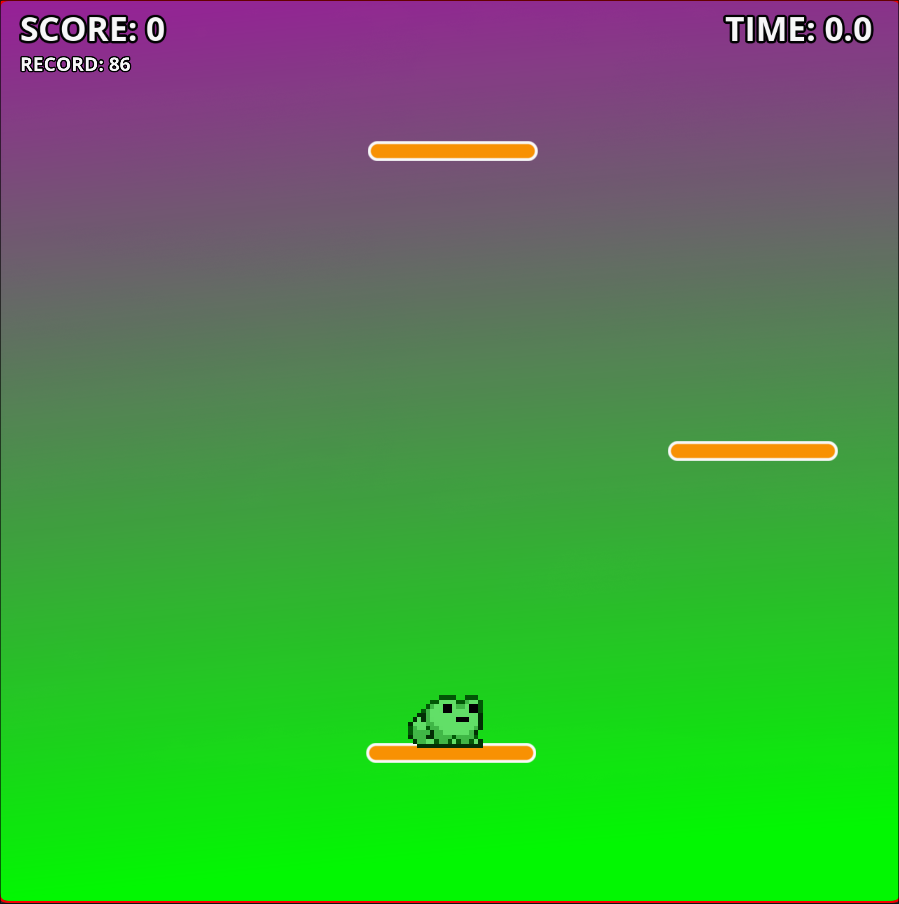
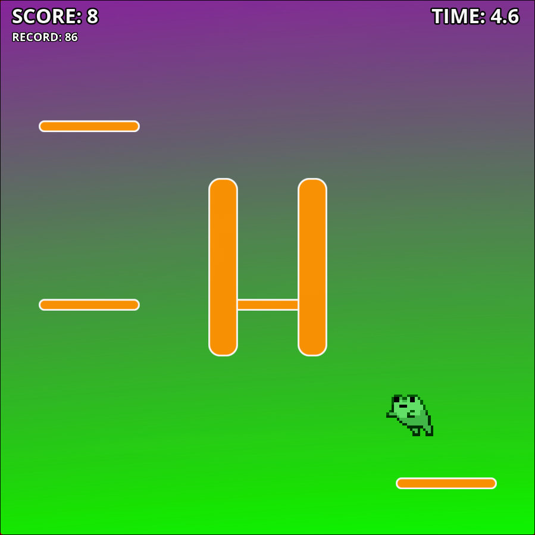
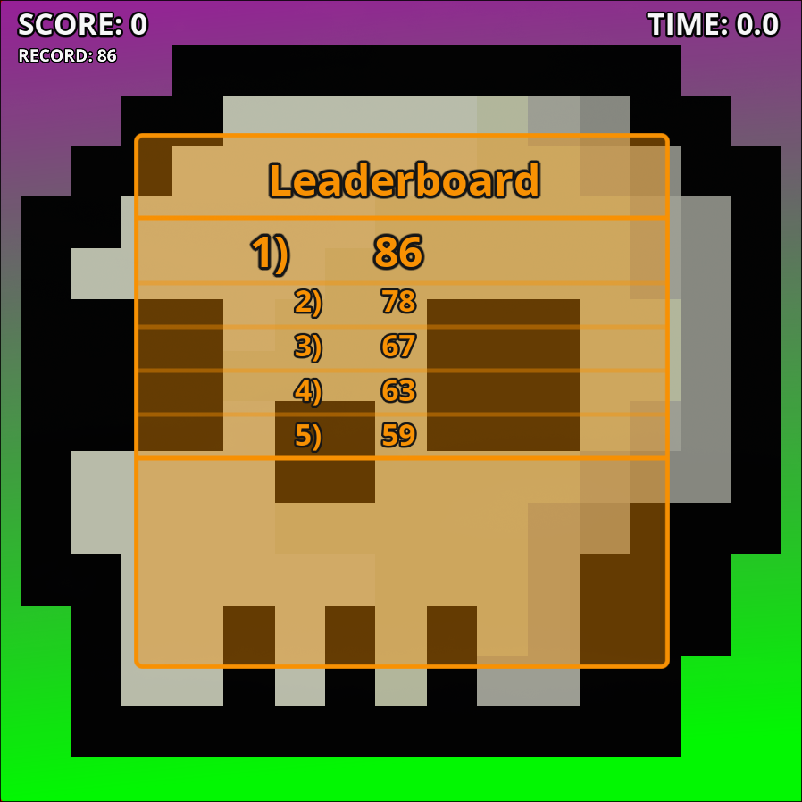
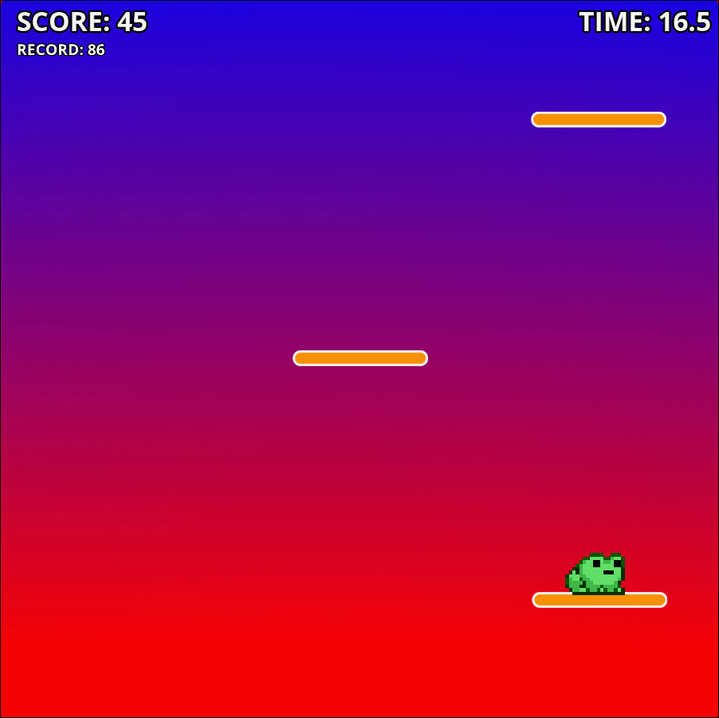

# Crak Game
## Contents
- [Introduction](#introduction)
- [Usage and Dependency](#usage-and-dependency)
- [Game Rule](#game-rule)
## Introduction
This project is a small game written entirely in C (and CMake), it is a timed arcade platform where the goal is to achieve the highest possible score within a limited amount of time. Here's some screenshots.

<p>
  
  
  
  
</p>

## Usage and Dependency
To install the program, a C compiler and `CMake` are required. Once you have downloaded the folder on a terminal enter `build/` and run:
```bash
cmake ..
cmake --build .
```
This will create the game executable in the `build/` folder and can be run with `./crak` on linux.
To install the game, use the command.
```bash
sudo cmake --install . --prefix /usr/local
```
Where `/usr/local` is the directory where the program will be installed, if you also have `make` available, you can simply run `sudo make install`. To uninstall, use:
```bash
sudo cmake --build . --target uninstall_crak
```
Then, if the game is installed in a directory included in the terminal's PATH, you can launch it using the command `crak`.

## Game Rule
The game involves reaching the greatest possible height, starting at 0 and ascending by one unit with each interaction. The play area is divided into three columns containing randomly placed platforms; the player begins in the center column at the bottom of the screen.
- you can jump to the right using the `right-arrow` key or `d`, and to the left using the `left-arrow` key or `a`. 
- If you jump onto a column without a platform, it's game over.
- The total time available is 20 seconds.
- The game-over screen displays the leaderboard (top five scores), and the game can be restarted by pressing `Enter`.
- If you want to exit the game, you can press `q` or `esc`.